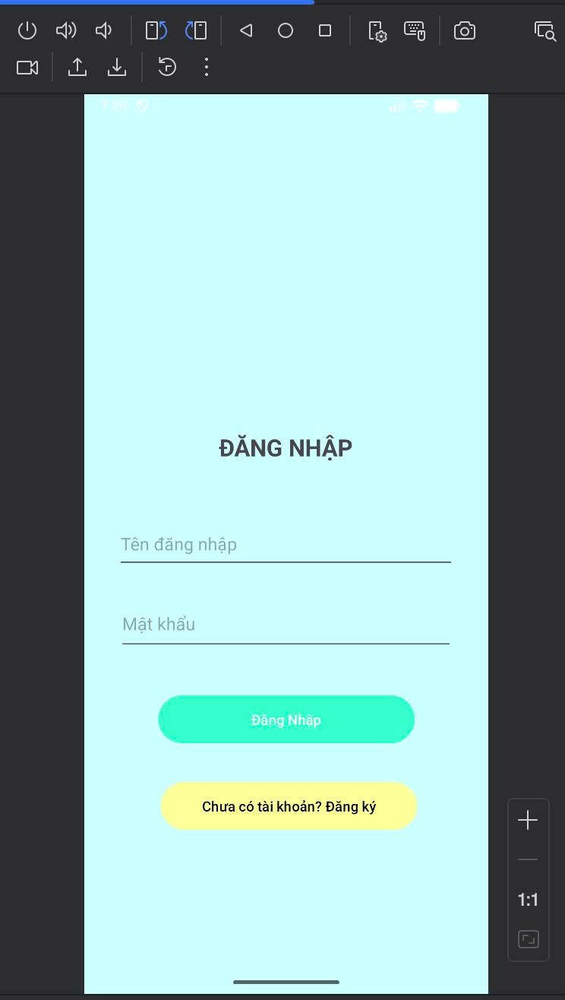
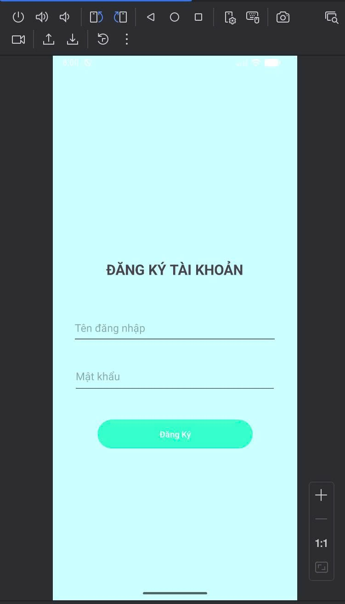
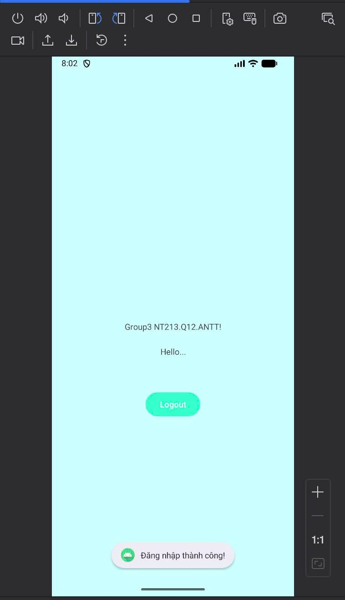

# 📱 Anatomy Of Mobile - Group 3 (NT213.Q12.ANTT)

## 📋 Giới thiệu

Đây là ứng dụng Android minh họa cho bài tập môn **Bảo mật Web (NT213.Q12.ANTT)** của **Nhóm 3** tại Trường Đại học Công nghệ Thông tin - ĐHQG TP.HCM (UIT).

Ứng dụng demo các chức năng xác thực người dùng cơ bản bao gồm **Đăng nhập** và **Đăng ký** sử dụng SQLite Database.

---

## 🛠️ Công nghệ sử dụng

| Công nghệ | Mô tả |
|-----------|-------|
| **Kotlin** | Ngôn ngữ lập trình chính |
| **Android SDK** | Target SDK 36, Min SDK 24 |
| **SQLite** | Cơ sở dữ liệu cục bộ |
| **Material Design** | Thiết kế giao diện |
| **Gradle (Kotlin DSL)** | Build system |

---

## 📁 Cấu trúc dự án

```
AnatomyOfMobile_Group3_NT213/
├── app/
│   ├── src/main/
│   │   ├── java/com/example/anatomyofmobile_group3_nt213/
│   │   │   ├── MainActivity.kt        # Màn hình chính sau đăng nhập
│   │   │   ├── LoginActivity.kt       # Màn hình đăng nhập
│   │   │   ├── RegisterActivity.kt    # Màn hình đăng ký
│   │   │   └── DatabaseHelper.kt      # Helper class quản lý SQLite
│   │   ├── res/
│   │   │   ├── layout/                # Các file giao diện XML
│   │   │   ├── values/                # Colors, Strings, Themes
│   │   │   └── drawable/              # Tài nguyên hình ảnh
│   │   └── AndroidManifest.xml        # Cấu hình ứng dụng
│   └── build.gradle.kts               # Cấu hình build module app
├── gradle/
│   └── libs.versions.toml             # Version catalog
├── build.gradle.kts                   # Cấu hình build project
└── settings.gradle.kts                # Cài đặt project
```

---

## ✨ Chức năng chính

### 🔐 Đăng nhập (Login)
- Nhập tên người dùng và mật khẩu
- Xác thực thông tin với database SQLite
- Chuyển đến màn hình chính khi đăng nhập thành công

### 📝 Đăng ký (Register)
- Tạo tài khoản mới với username và password
- Lưu thông tin vào database SQLite
- Kiểm tra đầu vào trước khi đăng ký

### 🚪 Đăng xuất (Logout)
- Quay về màn hình đăng nhập
- Kết thúc session hiện tại

---

## 🗄️ Cơ sở dữ liệu

Ứng dụng sử dụng **SQLite** để lưu trữ thông tin người dùng:

| Cột | Kiểu dữ liệu | Mô tả |
|-----|--------------|-------|
| `id` | INTEGER | Primary Key, Auto Increment |
| `username` | TEXT | Tên đăng nhập |
| `password` | TEXT | Mật khẩu |

---

## 🚀 Hướng dẫn cài đặt

### Yêu cầu hệ thống
- Android Studio (phiên bản mới nhất)
- JDK 11 trở lên
- Android SDK 36
- Thiết bị hoặc máy ảo Android (API 24+)

### Các bước cài đặt

1. **Clone repository**
   ```bash
   git clone https://github.com/mihwuan/NT213.Q12.ANTT_Group3_AnatomyOfMobile.git
   ```

2. **Mở project trong Android Studio**
   - Chọn `File > Open`
   - Điều hướng đến thư mục `AnatomyOfMobile_Group3_NT213`

3. **Sync Gradle**
   - Android Studio sẽ tự động sync các dependencies
   - Nếu không, chọn `File > Sync Project with Gradle Files`

4. **Chạy ứng dụng**
   - Kết nối thiết bị Android hoặc khởi động Emulator
   - Nhấn `Run` (Shift + F10)

---

## 📱 Screenshots

| Màn hình Đăng nhập | Màn hình Đăng ký | Màn hình Chính |
|-------------------|------------------|----------------|
| Login Screen | Register Screen | Main Screen |
||
---

## 👥 Thành viên nhóm

| STT | Họ và tên | MSSV |
|-----|-----------|------|
|  1  | Lê Văn Khôi | 23520770 |
|  2  | Nguyễn Đức Trung | 23521678 |
|  3  | Trịnh Nhật Duy | 23520394 |
|  4  | Đặng Minh Quân | 23521251 |
 
---

## 📄 License

Dự án này được phát triển cho mục đích học tập tại UIT.

---

## 📞 Liên hệ

- **Môn học**: NT213.Q12.ANTT - Bảo mật Web
- **Trường**: Đại học Công nghệ Thông tin - ĐHQG TP.HCM
- **Repository**: [GitHub](https://github.com/mihwuan/NT213.Q12.ANTT_Group3_AnatomyOfMobile)
